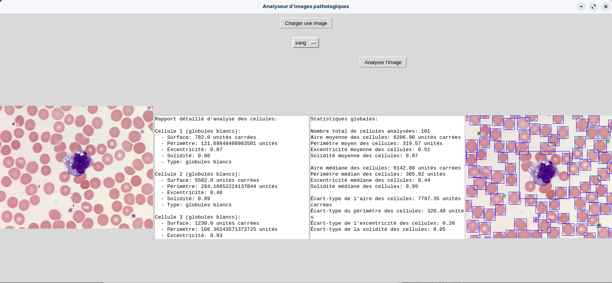
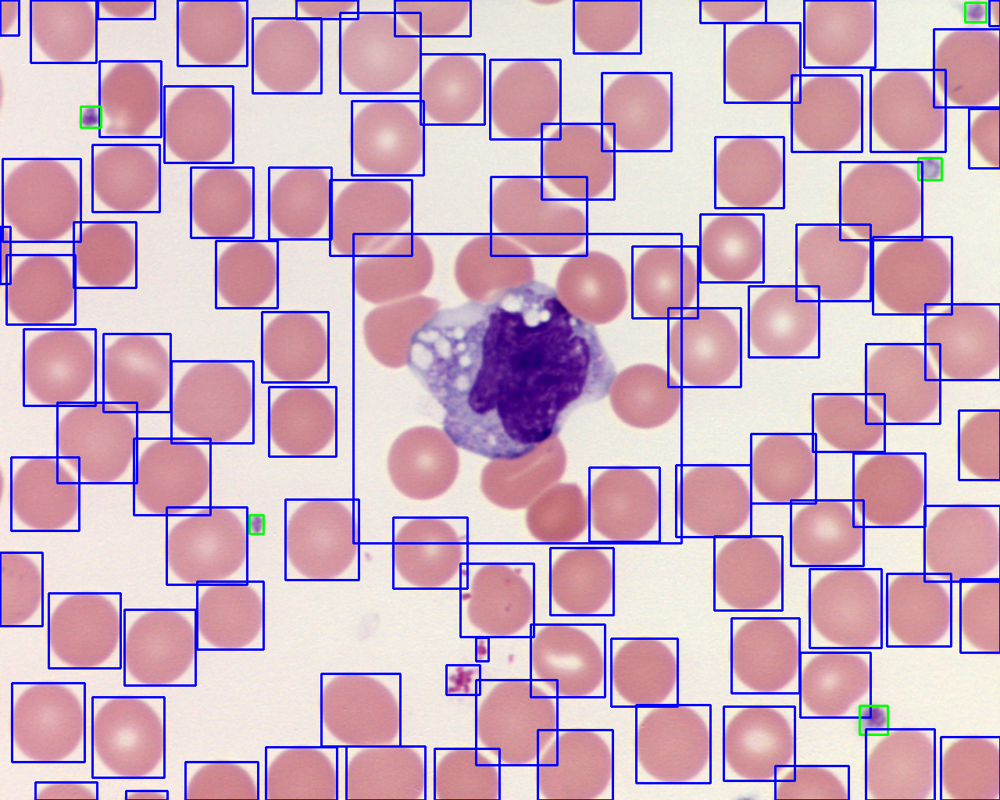

# Analyseur d'Images Pathologiques

Ce projet est une application d'analyse d'images pathologiques qui permet de charger une image, d'analyser les cellules présentes, de générer un rapport clinique détaillé et d'afficher une image annotée avec les anomalies détectées.

## Prérequis


Installation simple avec un rappatriement du repo sur votre local : 

```bash
git clone https://github.com/friteuseb/anapath
```
Assurez-vous d'avoir installé les bibliothèques Python nécessaires en exécutant :

```bash
pip install -r requirements.txt
```
Lancement de l'interface d'analyse avec : 

```bash
python3 pathology_image_gui.py
```

## Utilisation

1. **Charger une image** : Cliquez sur le bouton "Charger une image" pour sélectionner une image de votre système de fichiers.
2. **Analyser l'image** : Cliquez sur le bouton "Analyser l'image" pour analyser les cellules de l'image chargée.
3. **Voir le rapport et l'image annotée** : Le rapport détaillé et l'image annotée seront affichés dans l'interface.

## Structure du projet

- `pathology_image_analyzer.py` : Contient la logique d'analyse des images.
- `pathology_image_gui.py` : Contient l'interface utilisateur pour interagir avec l'application.
- `requirements.txt` : Liste des dépendances Python nécessaires pour exécuter le projet.

## Exemple

### Interface Utilisateur



### Rapport d'Analyse

```plaintext
Rapport détaillé d'analyse des cellules:

Cellule 1:
  - Surface (aire): 351.0 unités carrées
  - Interprétation: Grande
  - Périmètre: 111.656854 unités
  - Interprétation: Élevé
  - Excentricité: 0.96 (proche de 0 pour une forme circulaire, proche de 1 pour une forme elliptique)
  - Interprétation: Anormale
  - Solidité: 0.70 (proportion de la cellule qui est solide)
  - Interprétation: Faible
  - Type de cellule: Grande
```

### Image Annotée



## Contribuer

Les contributions sont les bienvenues ! Veuillez soumettre une pull request ou ouvrir une issue pour discuter des changements proposés.

## Licence

Ce projet est sous licence MIT. Voir le fichier `LICENSE` pour plus d'informations.